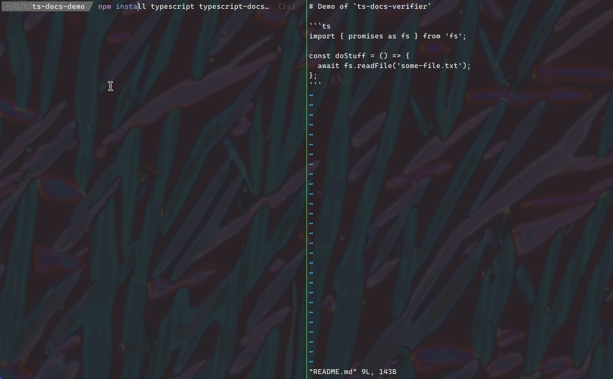

# `typescript-docs-verifier`

_Verifies that typescript examples in markdown files actually compile._

[](https://www.typescriptlang.org/)
[](https://standardjs.com)
[](https://www.apache.org/licenses/LICENSE-2.0)
[](https://github.com/bbc/typescript-docs-verifier)

## Why?

Ever copied a TypeScript code example from a README and found that it didn't even compile? This tool can help by verifying that all of your code examples compile correctly. And yes, the TypeScript code samples in this `README` are checked using this tool.



Inspired the by the [tut](https://github.com/tpolecat/tut) documentation compilation tool for scala.

## How it works

The selected markdown files are searched for `TypeScript` code blocks marked like this:

````Markdown
```typescript
// Some TypeScript code here
const write = 'some code';
```
````

These code blocks are extracted and any imports from the current project are replaced with an import of the `main` or `exports` from `package.json` (e.g. `import { compileSnippets } from 'typescript-docs-verifier'` would be replaced with `import { compileSnippets } from './dist/index'` for this project).

Each code snippet is compiled (but not run) and any compilation errors are reported. Code snippets must compile independently from any other code snippets in the file.

The library can also be used to type check `.tsx` files:

````Markdown
```tsx
import React from 'react'

const SomeComponent = () => (
  <div>
    This is a TSX component!
  </div>
)
```
````

### Ignoring code blocks

Individual code blocks can be ignored by preceding them with a `<!-- ts-docs-verifier:ignore -->` comment:

````Markdown
<!-- ts-docs-verifier:ignore -->
```typescript
// This block won't be compiled by typescript-docs-verifier
```
````

## Script usage

```bash
node_modules/.bin/typescript-docs-verifier [--input-files <markdown-files-to-test>] [--project <path-to-tsconfig-file>]
```

* `--input-files` is optional and defaults to `README.md`.
* `--project` is optional and defaults to the `tsconfig.json` file in the package root.
* Any compilation errors will be reported on the console.
* The exit code is 1 if there are any compilation errors and 0 otherwise.

## Library usage

### TypeScript

```typescript
import { compileSnippets, SnippetCompilationResult } from 'typescript-docs-verifier'
import * as http from 'http'

const markdownFiles = ['README', 'examples.md'] // defaults to 'README.md' if not provided
const tsconfigPath = 'docs-tsconfig.json' // defaults to the 'tsconfig.json' file in the package root
compileSnippets({ markdownFiles, project: tsconfigPath })
  .then((results: SnippetCompilationResult[]) => {
    results.forEach((result: SnippetCompilationResult) => {
      if (result.error) {
        console.log(`Error compiling example code block ${result.index} in file ${result.file}`)
        console.log(result.error.message)
        console.log('Original code:')
        console.log(result.snippet)
      }
    })
  })
  .catch((error: unknown) => {
    console.error('Error compiling TypeScript snippets', error)
  })
```

### JavaScript

```javascript
const { compileSnippets } = require('typescript-docs-verifier')

const markdownFiles = ['README.md', 'examples.md'] // defaults to 'README.md' if not provided
const tsconfigPath = 'docs-tsconfig.json' // defaults to the 'tsconfig.json' file in the package root
compileSnippets({ markdownFiles, project: tsconfigPath })
  .then((results) => {
    results.forEach((result) => {
      if (result.error) {
        console.log(`Error compiling example code block ${result.index} in file ${result.file}`)
        console.log(result.error.message)
        console.log('Original code:')
        console.log(result.snippet)
      }
    })
  })
  .catch((error) => {
    console.error('Error compiling TypeScript snippets', error)
  })
```

## Development

Run the tests:

```sh
npm install
npm test
```

## Contributing

See [these notes](./.github/CONTRIBUTING.md) for information for contributors.

## License

`typescript-docs-verifier` is available to all via the [Apache-2.0](./LICENSE) license.

Copyright &copy; 2017 BBC
